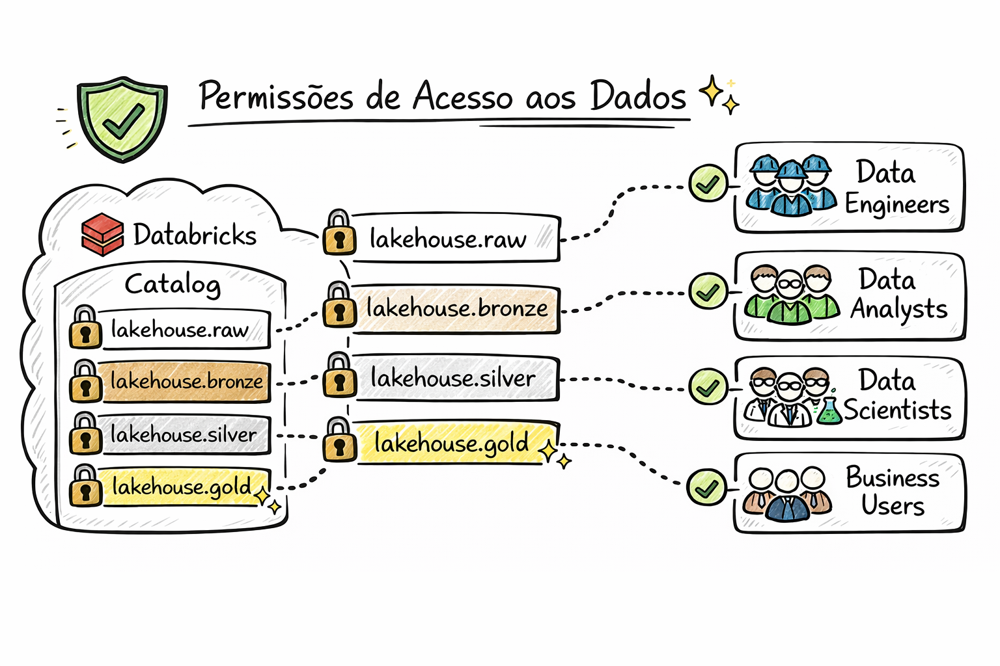

# Lakehouse Pipeline (Supabase + Hevo + Databricks)
Projeto de Engenharia de Dados que simula uma arquitetura moderna de Lakehouse para e-commerce, usando Supabase como origem transacional, Hevo para ingestão ELT e Databricks para processamento e análises.


---

## Visão geral
Este repositório gera dados transacionais de um e-commerce em Postgres (Supabase) com tabelas de clientes, produtos, pedidos e dimensões auxiliares. A intenção é alimentar um pipeline ELT, onde:
1. Os dados são gerados no Supabase.
2. O Hevo replica e carrega os dados no Lakehouse.
3. O Databricks transforma e publica camadas analíticas (Bronze, Silver e Gold).

---

## Stack principal
1. **Supabase (Postgres)**: base transacional e origem dos dados.
2. **Hevo**: ingestão ELT da origem para o Lakehouse.
3. **Databricks**: transformação, modelagem e camadas analíticas.

---

## Estrutura do projeto
- `data_sql.py`: cria tabelas simples e popula com dados sintéticos via `psycopg2`.
- `src/insert_data_supabase_db.py`: cria e popula o modelo completo via `SQLAlchemy`.
- `supabase/model_supabase_db.py`: modelo relacional completo (tabelas e relações).
- `supabase/conect_supabase_db.py`: conexão com o Supabase usando variáveis do `.env`.
- `src/list_auxiliar.py`: listas auxiliares (marcas, categorias, status, etc).
- `utils/create_catalog_schemas.ipynb`: criação de catálogos/schemas no Databricks.
- `utils/create_grant.ipynb`: criação de permissões de acesso no Databricks.
- `image/`: imagens de apoio do projeto.

---

## Pré-requisitos
- Python `>= 3.14`
- Conta no Supabase (Postgres)
- Conta no Hevo
- Workspace no Databricks

---

## Configuração local
Crie um arquivo `.env` na raiz do projeto. Existem duas formas de conexão usadas nos scripts:

### 1) Conexão usada por `data_sql.py`
```env
user=SEU_USUARIO
password=SUA_SENHA
host=SEU_HOST
port=5432
dbname=SEU_DB
```

### 2) Conexão usada por `supabase/conect_supabase_db.py`
```env
DB_HOST=SEU_HOST
DB_PORT=5432
DB_NAME=SEU_DB
DB_USER=SEU_USUARIO
DB_PASSWORD=SUA_SENHA
```

Observação: a URL de conexão usa `sslmode=require`.

---

## Instalação
1. Instale o `uv` globalmente (se ainda não tiver).
2. Inicie o ambiente virtual e instale dependências:

```bash
uv init
uv venv
uv sync
```

---

## Como gerar dados no Supabase
Você pode usar um dos dois caminhos abaixo:

### Opção A: Script simples (psycopg2)
```bash
python data_sql.py
```

### Opção B: Modelo completo (SQLAlchemy)
```bash
python src/insert_data_supabase_db.py
```

O script completo cria e popula:
- `clientes`
- `produtos`
- `pedidos`
- `itenspedido`
- `status`
- `formapagamento`
- `canalvenda`
- `categorias`
- `generocliente`
- `generoproduto`
- `marcas`
- `estadocivil`
- `emailmarketing`
- `entregue`

---

## Pipeline com Hevo + Databricks

### 1) Hevo
Configure um conector Postgres apontando para o Supabase:
- Host, porta, usuário e senha do seu Supabase.
- Habilite CDC para replicação incremental (se disponível no seu plano).

Em seguida, configure o destino no Databricks (Lakehouse) e valide a ingestão.

### 2) Databricks
No Databricks, organize as camadas:
1. **Bronze**: dados crus replicados pelo Hevo.
2. **Silver**: dados limpos e normalizados.
3. **Gold**: visões analíticas para BI.

Na pasta `utils/`:
- `create_catalog_schemas.ipynb`: scripts de criação de catálogos e schemas.
- `create_grant.ipynb`: scripts de permissões.



Exemplos de transformações:
- Normalizar dimensões de clientes e produtos.
- Agregar receita por período, categoria, marca e região.
- Criar métricas de churn e retenção.

---

## Modelo de dados (simplificado)
Tabelas principais:
- `clientes`
- `produtos`
- `pedidos`
- `itenspedido`

---

## Próximos passos sugeridos
1. Criar schemas e notebooks no Databricks.
2. Publicar dashboards em BI (Power BI, Tableau ou Superset).
3. Automatizar a geração de dados e a ingestão via agendamentos.

---

## Licença
Veja `LICENSE`.
