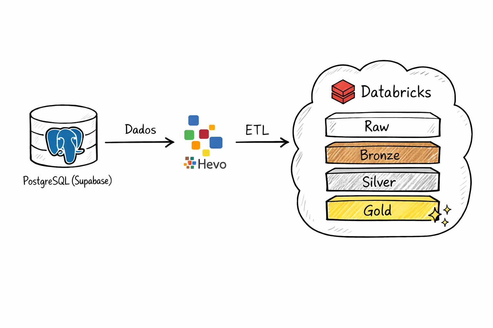

<p align="center">
  
  <h1 align="center">E-COMMERCE DE TENIS<br>Lakehouse Pipeline</h1>
</p>

Pipeline completo de Engenharia de Dados para e-commerce, com geração de dados transacionais no Supabase, ingestão via Hevo Data, processamento no Databricks (camadas Bronze/Silver/Gold) e consumo analítico em Streamlit.



---

## Arquitetura

```text
Supabase (PostgreSQL)
        |
        | CDC / ELT
        v
Hevo Data
        |
        | carga contínua
        v
Databricks (Unity Catalog)
  raw -> bronze -> silver -> gold
        |
        | consultas analíticas
        v
Streamlit (dashboard)
```

---

## Objetivo

Este projeto simula um cenário real de Lakehouse para e-commerce:

1. Gera dados sintéticos (clientes, produtos, pedidos e dimensões) no Supabase.
2. Replica os dados para o Databricks com Hevo Data.
3. Estrutura e transforma dados em camadas analíticas.
4. Expõe indicadores de negócio em um app Streamlit.

---

## Stack

- Supabase (PostgreSQL): origem transacional
- Hevo Data: ingestão ELT/CDC
- Databricks: processamento e modelagem Lakehouse
- Streamlit: consumo analítico (dashboard)
- Python 3.14 + SQLAlchemy + psycopg2 + Faker

---

## Estrutura do repositório

- `src/insert_data_supabase_db.py`: cria e popula dados no Supabase
- `supabase/model_supabase_db.py`: modelo relacional completo
- `supabase/conect_supabase_db.py`: conexão com Supabase via `.env`
- `pipeline/pipeline_bronze/transformations/*.sql`: transformação Bronze (streaming live tables)
- `utils/create_catalog_schemas.ipynb`: criação de catalog/schemas no Databricks
- `utils/create_grant.ipynb`: permissões no Databricks
- `image/`: diagramas e imagens de apoio

---

## 1) Configuração local

### Pré-requisitos

- Python `>= 3.14`
- `uv` instalado
- Conta no Supabase
- Conta no Hevo Data
- Workspace Databricks com Unity Catalog habilitado

### Instalação

```bash
uv venv
uv sync
```

Se for executar Streamlit localmente, adicione dependências:

```bash
uv add streamlit databricks-sql-connector pandas
```

### Variáveis de ambiente (`.env`)

Use um `.env` na raiz do projeto:

```env
# Supabase / PostgreSQL
DB_HOST=SEU_HOST
DB_PORT=5432
DB_NAME=SEU_DB
DB_USER=SEU_USUARIO
DB_PASSWORD=SUA_SENHA

# Databricks (para Streamlit)
DATABRICKS_SERVER_HOSTNAME=adb-xxxx.azuredatabricks.net
DATABRICKS_HTTP_PATH=/sql/1.0/warehouses/xxxxxxxx
DATABRICKS_TOKEN=dapiXXXXXXXXXXXXXXXX
```

Observação: a conexão do Supabase usa `sslmode=require` em `supabase/conect_supabase_db.py`.

---

## 2) Gerar dados no Supabase

Execute:

```bash
python src/insert_data_supabase_db.py
```

O script cria e popula tabelas como:

- `clientes`
- `produtos`
- `pedidos`
- `itenspedido`
- `status`, `formapagamento`, `canalvenda`, `categorias`, `marcas`, etc.

Dica: para recriar tudo do zero, descomente `drop_tables()` no final de `src/insert_data_supabase_db.py`.

---

## 3) Ingestão Supabase -> Hevo Data

### Fonte (Source) no Hevo

Configure PostgreSQL apontando para o Supabase:

- Host, porta, database, usuário e senha
- SSL habilitado
- CDC/incremental habilitado (se disponível no plano)

### Destino (Destination) no Hevo

Configure Databricks como destino.

Recomendação de organização:

- Catalog: `lakehouse`
- Schema bruto: `raw`
- Tabelas: `clientes`, `produtos`, `pedidos`, `itenspedido` e dimensões

Valide no Databricks se existem tabelas como:

- `lakehouse.raw.clientes`
- `lakehouse.raw.pedidos`
- `lakehouse.raw.itenspedido`
- `lakehouse.raw.produtos`

---

## 4) Databricks: Bronze, Silver e Gold

### 4.1 Criar catálogo e schemas

Use o notebook:

- `utils/create_catalog_schemas.ipynb`

Ele cria estruturas como:

- `lakehouse.bronze`
- `lakehouse.silver`
- `lakehouse.gold`

### 4.2 Permissões

Use:

- `utils/create_grant.ipynb`

### 4.3 Camada Bronze (já pronta no repositório)

Os SQLs em `pipeline/pipeline_bronze/transformations/` criam tabelas Bronze via streaming, por exemplo:

- `pipeline/pipeline_bronze/transformations/clientes_bronze.sql`
- `pipeline/pipeline_bronze/transformations/pedidos_bronze.sql`

Eles leem de `lakehouse.raw.*` e adicionam `ingestion_ts_utc`.

### 4.4 Exemplo de Silver

```sql
CREATE OR REPLACE TABLE lakehouse.silver.pedidos AS
SELECT
  p.id,
  p.id_cliente,
  p.data_pedido,
  p.total,
  p.id_status,
  p.id_forma_pagamento,
  p.id_canalvenda,
  p.ingestion_ts_utc
FROM lakehouse.bronze.pedidos p
WHERE p.total >= 0;
```

### 4.5 Exemplo de Gold

```sql
CREATE OR REPLACE TABLE lakehouse.gold.faturamento_mensal AS
SELECT
  date_trunc('month', data_pedido) AS mes,
  COUNT(*) AS qtd_pedidos,
  SUM(total) AS receita_total,
  AVG(total) AS ticket_medio
FROM lakehouse.silver.pedidos
GROUP BY 1
ORDER BY 1;
```

---

## 5) Consumo no Streamlit

Crie um arquivo `app_streamlit.py` na raiz com exemplo mínimo:

```python
import os
import pandas as pd
import streamlit as st
from databricks import sql
from dotenv import load_dotenv

load_dotenv()

st.set_page_config(page_title="Lakehouse Dashboard", layout="wide")
st.title("Dashboard de Vendas - Lakehouse")

query = """
SELECT mes, qtd_pedidos, receita_total, ticket_medio
FROM lakehouse.gold.faturamento_mensal
ORDER BY mes DESC
LIMIT 24
"""

with sql.connect(
    server_hostname=os.getenv("DATABRICKS_SERVER_HOSTNAME"),
    http_path=os.getenv("DATABRICKS_HTTP_PATH"),
    access_token=os.getenv("DATABRICKS_TOKEN"),
) as connection:
    with connection.cursor() as cursor:
        cursor.execute(query)
        rows = cursor.fetchall()
        cols = [c[0] for c in cursor.description]

_df = pd.DataFrame(rows, columns=cols)

st.dataframe(_df, use_container_width=True)

if not _df.empty:
    st.line_chart(_df.set_index("mes")["receita_total"])
```

Executar:

```bash
streamlit run app_streamlit.py
```

---

## Checklist de execução ponta a ponta

1. Configurar `.env` com credenciais do Supabase e Databricks.
2. Rodar `python src/insert_data_supabase_db.py`.
3. Configurar pipeline no Hevo (Source Supabase + Destination Databricks).
4. Validar dados em `lakehouse.raw`.
5. Rodar Bronze (arquivos SQL do diretório `pipeline/pipeline_bronze/transformations/`).
6. Criar Silver e Gold (exemplos acima, ajustando regras de negócio).
7. Subir dashboard com `streamlit run app_streamlit.py`.

---

## Troubleshooting rápido

- Sem dados no Databricks:
  - Validar credenciais/SSL no Hevo e status do pipeline.
- Erro de conexão no Supabase:
  - Revisar `DB_HOST`, `DB_PORT`, `DB_NAME`, `DB_USER`, `DB_PASSWORD`.
- Erro no Streamlit com Databricks:
  - Validar `DATABRICKS_SERVER_HOSTNAME`, `DATABRICKS_HTTP_PATH`, `DATABRICKS_TOKEN`.
- Tabelas Bronze não criam:
  - Confirmar se `lakehouse.raw.*` já existe e se há permissões de escrita.

---

## Licença

Consulte `LICENSE`.
